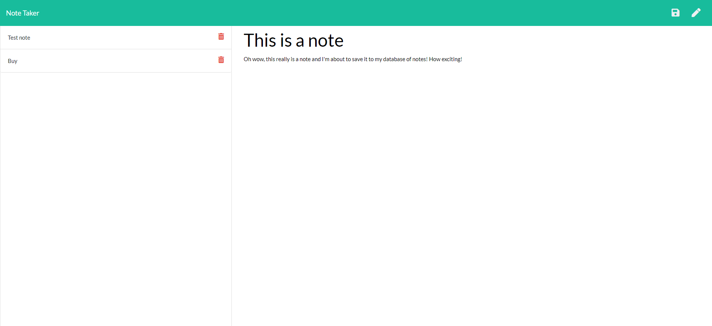
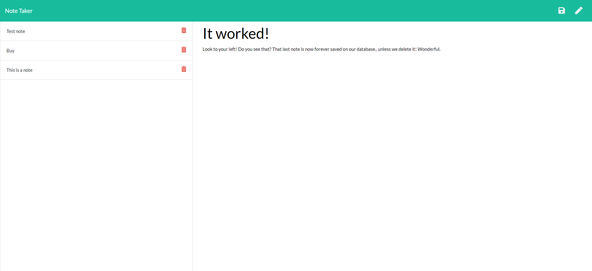

# Title

## Table of Contents

- [_Project Link_](#project-link)
- [_Getting Started_](#getting-started)
- [_About my Project_](#about-my-project)
- [_Screenshots_](#screenshots)

## Project Link

[_View my deployed application here_](https://limitless-island-19794.herokuapp.com/)

## Getting Started

```
git clone <git@github.com:misha244/note-taker-app.git>
cd <note-taker-app>
npm install
```

## About my Project

This is a simple Note Taker application that allows users to add and view saved notes. This application uses an express backend and save and retrieve note data from a JSON file.

I would to like to improve it by adding a delete function as well, so that the user can delete any notes they no longer need.

## Screenshots

### Note Taker Homepage


### New Note Example



### Note about the Saved Note



## Fin
